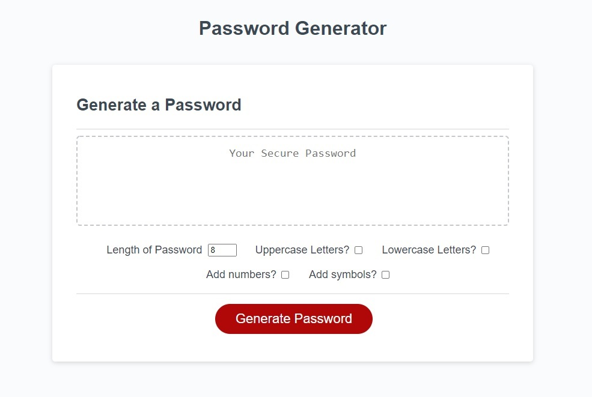

# **Password Generator**

## Table of Contents

* [Description](#description)
* [Requirements](#requirements)
* [Installation](#installation)

## Description
---
Password Generator let's you generate a random password of your choice between 8 and 128 characters, it's letting you choose what kind of password you'd like to do. For example; it's letting you choose if you want to have upper case or lower case letter, numbers, symbols or all of the above into your password. If you choose less than 8 or more than 128 letters you will get prompt saying you have to choose between 8 or 128. If you do not choose any checkboxes, you will again get prompt saying you at least have to choose one of the checkboxes below.

Deployed Project: https://erenozgur98.github.io/password-generator/

---



## Requirements
---
```
GIVEN I need a new, secure password
WHEN I click the button to generate a password
THEN I am presented with a series of prompts for password criteria
WHEN prompted for password criteria
THEN I select which criteria to include in the password
WHEN prompted for the length of the password
THEN I choose a length of at least 8 characters and no more than 128 characters
WHEN prompted for character types to include in the password
THEN I choose lowercase, uppercase, numeric, and/or special characters
WHEN I answer each prompt
THEN my input should be validated and at least one character type should be selected
WHEN all prompts are answered
THEN a password is generated that matches the selected criteria
WHEN the password is generated
THEN the password is either displayed in an alert or written to the page
```

## Installation
---
No need for any installation for this project. It can be used in the website.

See deployed site here: https://erenozgur98.github.io/password-generator/

See repository here: https://github.com/erenozgur98
